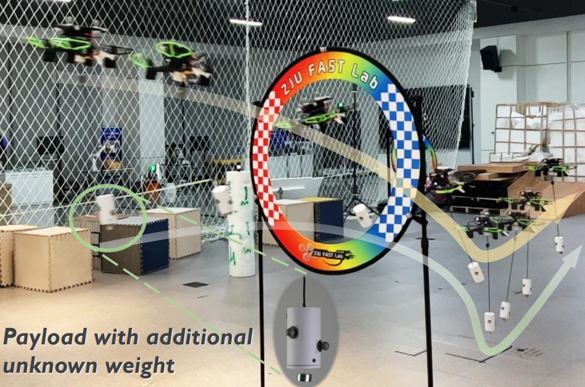
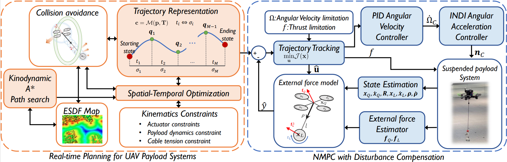
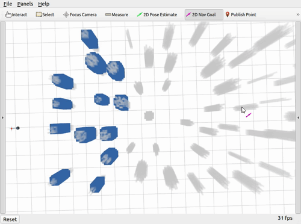

# AutoTrans: A Complete Planning and Control Framework for Autonomous UAV Payload Transportation

[](https://youtu.be/X9g-ivBqy5g)

**Video**: [YouTube](https://youtu.be/X9g-ivBqy5g) | [Bilibili](https://www.bilibili.com/video/BV1aM4y1a7c9)

## Introduction
**AutoTrans** presents a real-time and robust planning and control framework for quadrotor with payload. It can generate the dynamic feasible trajectory considering the time-varying shape and deal with the disturbance while executing trajectory. 



This repo includes a real-time motion planning, a disturbance-aware NMPC and a simple simulation for a quadrotor with a suspended payload.


**Authors**: Haojia Li, Haokun Wang, [Chen Feng](https://chen-albert-feng.github.io/AlbertFeng.github.io/), [Fei Gao*](http://zju-fast.com/fei-gao/), [Boyu Zhou*](http://sysu-star.com/), and [Shaojie Shen](https://uav.hkust.edu.hk/group/). 

**Institutions**: [HKUST Aerial Robotics Group](https://uav.hkust.edu.hk/), [SYSU STAR Group](http://sysu-star.com/), and [ZJU FAST Lab](http://zju-fast.com/).

**Paper**: [AutoTrans: A Complete Planning and Control Framework for Autonomous UAV Payload Transportation](https://doi.org/10.1109/LRA.2023.3313010), IEEE Robotics and Automation Letters (RA-L), 2023. [IEEE Spectrum](https://spectrum.ieee.org/video-friday-reflex-grasping)

```bibtex
@article{li2023autotrans,
  title={AutoTrans: A Complete Planning and Control Framework for Autonomous UAV Payload Transportation}, 
  author={Li, Haojia and Wang, Haokun and Feng, Chen and Gao, Fei and Zhou, Boyu and Shen, Shaojie},
  journal={IEEE Robotics and Automation Letters}, 
  year={2023},
  volume={8},
  number={10},
  pages={6859-6866},
  doi={10.1109/LRA.2023.3313010}}
```

If you find this work useful or interesting, please kindly give us a star ⭐, thanks!😀

## Setup

Compiling tests passed on Ubuntu 20.04/18.04 with ROS installed.
### Prerequisites
- [ROS](http://wiki.ros.org/ROS/Installation) (tested with Noetic)
  
```bash
sudo apt install ros-"${ROS_DISTRO}"-mavros-msgs
```

### Compiling and Running
```bash
# Compile the code
mkdir -p autotrans_ws/src
cd autotrans_ws/src
git clone https://github.com/HKUST-Aerial-Robotics/AutoTrans
cd ..
catkin_make -DCMAKE_BUILD_TYPE=Release

# Run the simulation with planner and controller
source devel/setup.bash
roslaunch payload_planner simple_run.launch
```
You should see the simulation in rviz. You can use the `2D Nav Goal` to set the goal position. The red arrow on the quadrotor represents the estimated disturbance force (like rotor drag).



### Tip: Boost Your Computer
This can make the MPC solve faster in each iteration.
```bash
sudo apt install cpufrequtils
sudo cpufreq-set -g performance
```


## Acknowledgements
We use [MINCO](https://github.com/ZJU-FAST-Lab/GCOPTER) as our trajectory representation.

We borrow the framework from [Fast-Planner](https://github.com/HKUST-Aerial-Robotics/Fast-Planner) and [Ego-Planner-v2](https://github.com/ZJU-FAST-Lab/EGO-Planner-v2)

Thanks to [rpg_mpc](https://github.com/uzh-rpg/rpg_mpc) for a good reference.